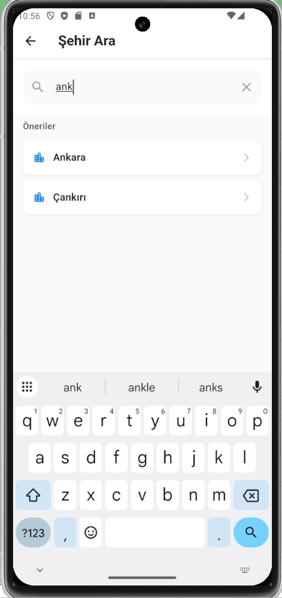
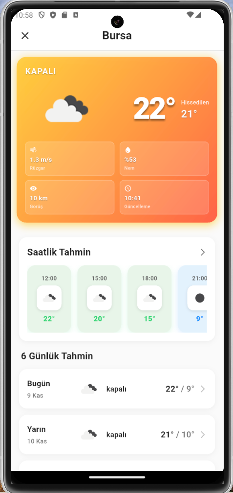
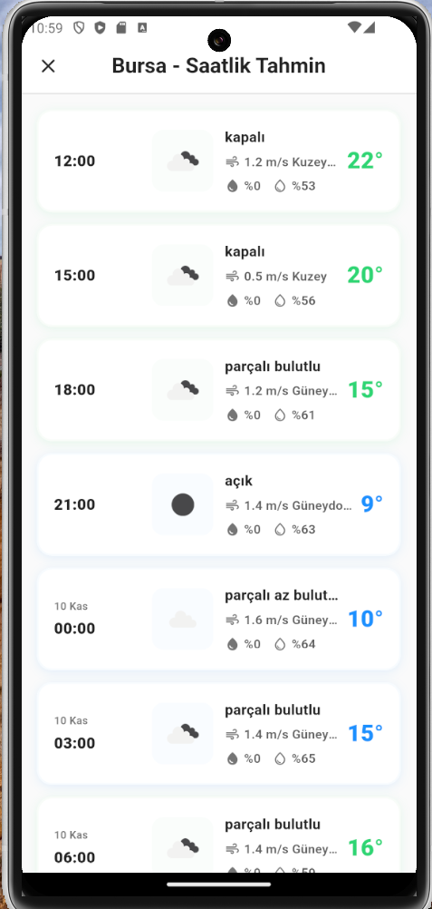

📸 Screenshots
<div align="center">

  <figure style="display:inline-block; margin:10px;">
    
    <figcaption>
      <strong>Home Screen</strong><br/>
      Displays weather summaries for popular cities with quick access to details.
    </figcaption>
  </figure>

  <figure style="display:inline-block; margin:10px;">
    
    <figcaption>
      <strong>City Details</strong><br/>
      Shows detailed current weather including temperature, humidity, and wind.
    </figcaption>
  </figure>

  <figure style="display:inline-block; margin:10px;">
    
    <figcaption>
      <strong>Hourly Forecast</strong><br/>
      Provides a clear 24-hour hourly weather forecast.
    </figcaption>
  </figure>

  <figure style="display:inline-block; margin:10px;">
    
    <figcaption>
      <strong>Daily Forecast</strong><br/>
      Presents a 6-day forecast with temperature trends and conditions.
    </figcaption>
  </figure>

</div>


# 🌤️ Weather Application

A modern and user-friendly Flutter weather application. It provides up-to-date weather information for all cities in Turkey, including location-based weather, daily forecasts, and hourly forecasts.


## 💡 Skills Gained in This Project

* **Flutter & Dart**: Mobile application development
* **State Management**: State management using the Provider pattern
* **API Integration**: RESTful API consumption and data processing
* **Location Services**: GPS integration and permission handling
* **UI/UX Design**: Modern interface design and animations
* **Software Architecture**: Clean code and modular structure
* **Git/GitHub**: Version control and project management

## 📸 Screenshots

<div align="center">
  
  
  
  
</div>

## ✨ Features

### 🎯 Core Features

* **Location-Based Weather**: Automatic location detection via GPS and weather display
* **City Search**: Search across all cities in Turkey
* **Popular Cities**: Quick access list of popular cities
* **Daily Forecast**: 6-day detailed weather forecast
* **Hourly Forecast**: 24-hour hourly weather forecast
* **Detailed Information**: Wind speed, humidity, visibility, feels-like temperature

### 🎨 User Interface

* **Modern Design**: Clean and modern UI using Material Design 3
* **Dynamic Colors**: Gradient backgrounds that change based on temperature
* **Turkish Language Support**: Fully localized Turkish interface and date formats
* **Responsive Design**: Optimized for all screen sizes
* **Smooth Animations**: Fluid transitions and animations

### 🔧 Technical Features

* **State Management**: Centralized state management using the Provider pattern
* **API Integration**: OpenWeatherMap API integration
* **Location Services**: Location handling via Geolocator
* **Error Handling**: Comprehensive error handling and user feedback
* **Environment Variables**: Secure API key management

## 🚀 Installation

### Requirements

* Flutter SDK 3.9.2 or higher
* Dart SDK 3.9.2 or higher
* Android Studio / VS Code
* Android SDK (for Android development)
* Xcode (for iOS development – macOS only)

### Step 1: Clone the Project

```bash
git clone https://github.com/username/weather-app.git
cd weather-app
```

### Step 2: Install Dependencies

```bash
flutter pub get
```

### Step 3: API Key Configuration

1. Create a `.env` file:

```bash
cp env.example .env
```

2. Edit the `.env` file and add your OpenWeatherMap API key:

```env
OPENWEATHER_API_KEY=your_api_key_here
OPENWEATHER_API_URL=https://api.openweathermap.org/data/2.5
```

#### How to Get an OpenWeatherMap API Key

1. Register at [OpenWeatherMap](https://openweathermap.org/)
2. Go to the **API Keys** section
3. Generate a new API key (the free plan is sufficient)
4. Add your API key to the `.env` file

### Step 4: Android Permissions

Location permissions for Android are preconfigured. The following permissions are included in `AndroidManifest.xml`:

* `ACCESS_FINE_LOCATION`
* `ACCESS_COARSE_LOCATION`

### Step 5: Run the Application

```bash
# For Android
flutter run

# For iOS (macOS only)
flutter run

# Run on a specific device
flutter devices
flutter run -d <device_id>
```

## 📱 Usage

### Home Screen

* When the app launches, weather data for popular cities is automatically loaded
* Tap on any city card to view detailed weather information

### Using Location

1. Tap the location icon in the top-right corner
2. Grant location permission (on first use)
3. Weather data for your current location will be displayed automatically

### City Search

1. Tap the search icon on the home screen
2. Enter a city name (Turkish characters are supported)
3. Select a city from the search results

### Detail Screen

* **Current Weather**: Temperature, description, and weather icon
* **Feels Like**: Perceived temperature based on wind and humidity
* **Details**: Wind speed, humidity, visibility
* **Hourly Forecast**: 24-hour detailed forecast
* **Daily Forecast**: 6-day weather forecast

## 🏗️ Project Structure

```
lib/
├── main.dart                 # Application entry point
├── models/                   # Data models
│   ├── weather_model.dart
│   ├── forecast_model.dart
│   └── hourly_forecast_model.dart
├── providers/                # State management
│   └── weather_provider.dart
├── screens/                  # Screens
│   ├── home_screen.dart
│   ├── search_screen.dart
│   ├── city_detail_screen.dart
│   └── hourly_detail_screen.dart
├── services/                 # Services
│   ├── weather_service.dart
│   └── location_service.dart
├── utils/                    # Utility helpers
│   ├── constants.dart
│   └── turkish_cities.dart
└── widgets/                  # Custom widgets
    ├── weather_card.dart
    └── forecast_item.dart
```

## 🛠️ Technologies Used

### Flutter & Dart

* **Flutter 3.9.2**: Cross-platform UI framework
* **Dart 3.9.2**: Programming language

### Packages

* **provider (^6.1.1)**: State management
* **http (^1.2.0)**: HTTP requests
* **geolocator (^11.0.0)**: Location services
* **shared_preferences (^2.2.2)**: Local data storage
* **intl (^0.19.0)**: Date and number formatting
* **flutter_dotenv (^5.1.0)**: Environment variable management

### API

* **OpenWeatherMap API**: Weather data provider

## 🔐 Security

* API keys are stored in the `.env` file and protected via `.gitignore`
* Sensitive information is never hardcoded
* `.env.example` is provided as a configuration template

## 🐛 Known Issues

* Location services may require manual location setup on emulators
* Initial location permission request may occasionally be delayed on Android

## 📝 License

This project is licensed under the MIT License.

## 👨‍💻 Developer

This project was developed using Flutter and modern software development best practices.

### Technical Details

#### State Management

* Centralized state management using the Provider pattern
* Reactive programming with `ChangeNotifier`
* Efficient state sharing across the widget tree

#### API Integration

* RESTful API integration
* Error handling and retry mechanisms
* Timeout management
* Full support for Turkish characters

#### Location Services

* GPS-based location detection
* Permission handling
* Fallback mechanisms (last known location)
* Emulator support

#### UI/UX

* Material Design 3
* Responsive layout
* Smooth animations
* Loading states
* Error states

---


# 🌤️ Hava Durumu Uygulaması

Modern ve kullanıcı dostu bir Flutter hava durumu uygulaması. Türkiye'nin tüm şehirleri için güncel hava durumu bilgileri, konum bazlı hava durumu, günlük ve saatlik tahminler sunar.


## 💡 Bu Projede Edinilen Beceriler

- **Flutter & Dart**: Mobil uygulama geliştirme
- **State Management**: Provider pattern ile state yönetimi
- **API Entegrasyonu**: RESTful API kullanımı ve veri işleme
- **Konum Servisleri**: GPS entegrasyonu ve izin yönetimi
- **UI/UX Tasarım**: Modern arayüz tasarımı ve animasyonlar
- **Yazılım Mimarisi**: Temiz kod ve modüler yapı
- **Git/GitHub**: Versiyon kontrolü ve proje yönetimi

## 📸 Ekran Görüntüleri

<div align="center">
  
  
  
  
</div>

## ✨ Özellikler

### 🎯 Temel Özellikler
- **Konum Bazlı Hava Durumu**: GPS ile otomatik konum tespiti ve hava durumu gösterimi
- **Şehir Arama**: Türkiye'nin tüm şehirlerinde arama yapabilme
- **Popüler Şehirler**: Hızlı erişim için popüler şehirlerin listesi
- **Günlük Tahmin**: 6 günlük detaylı hava durumu tahmini
- **Saatlik Tahmin**: 24 saatlik saatlik hava durumu tahmini
- **Detaylı Bilgiler**: Rüzgar hızı, nem oranı, görüş mesafesi, hissedilen sıcaklık

### 🎨 Kullanıcı Arayüzü
- **Modern Tasarım**: Material Design 3 ile modern ve şık arayüz
- **Dinamik Renkler**: Sıcaklığa göre değişen gradient arka planlar
- **Türkçe Dil Desteği**: Tam Türkçe arayüz ve tarih formatları
- **Responsive Tasarım**: Tüm ekran boyutlarına uyumlu
- **Smooth Animations**: Akıcı geçişler ve animasyonlar

### 🔧 Teknik Özellikler
- **State Management**: Provider pattern ile merkezi state yönetimi
- **API Integration**: OpenWeatherMap API entegrasyonu
- **Location Services**: Geolocator ile konum servisleri
- **Error Handling**: Kapsamlı hata yönetimi ve kullanıcı bildirimleri
- **Environment Variables**: Güvenli API key yönetimi

## 🚀 Kurulum

### Gereksinimler
- Flutter SDK 3.9.2 veya üzeri
- Dart SDK 3.9.2 veya üzeri
- Android Studio / VS Code
- Android SDK (Android geliştirme için)
- Xcode (iOS geliştirme için - sadece macOS)

### Adım 1: Projeyi Klonlayın
```bash
git clone https://github.com/kullaniciadi/hava-durumu.git
cd hava-durumu
```

### Adım 2: Bağımlılıkları Yükleyin
```bash
flutter pub get
```

### Adım 3: API Key Yapılandırması

1. `.env` dosyası oluşturun:
```bash
cp env.example .env
```

2. `.env` dosyasını düzenleyin ve OpenWeatherMap API key'inizi ekleyin:
```env
OPENWEATHER_API_KEY=your_api_key_here
OPENWEATHER_API_URL=https://api.openweathermap.org/data/2.5
```

#### OpenWeatherMap API Key Nasıl Alınır?
1. [OpenWeatherMap](https://openweathermap.org/) sitesine kaydolun
2. API Keys bölümüne gidin
3. Yeni bir API key oluşturun (ücretsiz plan yeterlidir)
4. API key'inizi `.env` dosyasına ekleyin

### Adım 4: Android İzinleri

Android için konum izinleri otomatik olarak yapılandırılmıştır. `AndroidManifest.xml` dosyasında şu izinler mevcuttur:
- `ACCESS_FINE_LOCATION`
- `ACCESS_COARSE_LOCATION`

### Adım 5: Uygulamayı Çalıştırın

```bash
# Android için
flutter run

# iOS için (sadece macOS)
flutter run

# Belirli bir cihaz için
flutter devices
flutter run -d <device_id>
```

## 📱 Kullanım

### Ana Ekran
- Uygulama açıldığında popüler şehirlerin hava durumu otomatik olarak yüklenir
- Her şehir kartına tıklayarak detaylı bilgilere ulaşabilirsiniz

### Konum Kullanımı
1. Sağ üstteki konum ikonuna tıklayın
2. Konum izni verin (ilk kullanımda)
3. Mevcut konumunuzun hava durumu otomatik olarak gösterilir

### Şehir Arama
1. Ana ekranda arama ikonuna tıklayın
2. Şehir adını yazın (Türkçe karakterler desteklenir)
3. Sonuçlardan bir şehir seçin

### Detay Ekranı
- **Mevcut Hava Durumu**: Sıcaklık, açıklama, ikon
- **Hissedilen Sıcaklık**: Rüzgar ve nem etkisiyle hissedilen sıcaklık
- **Detaylar**: Rüzgar hızı, nem oranı, görüş mesafesi
- **Saatlik Tahmin**: 24 saatlik detaylı tahmin
- **Günlük Tahmin**: 6 günlük hava durumu tahmini

## 🏗️ Proje Yapısı

```
lib/
├── main.dart                 # Uygulama giriş noktası
├── models/                   # Veri modelleri
│   ├── weather_model.dart
│   ├── forecast_model.dart
│   └── hourly_forecast_model.dart
├── providers/                # State management
│   └── weather_provider.dart
├── screens/                  # Ekranlar
│   ├── home_screen.dart
│   ├── search_screen.dart
│   ├── city_detail_screen.dart
│   └── hourly_detail_screen.dart
├── services/                 # Servisler
│   ├── weather_service.dart
│   └── location_service.dart
├── utils/                    # Yardımcı fonksiyonlar
│   ├── constants.dart
│   └── turkish_cities.dart
└── widgets/                  # Özel widget'lar
    ├── weather_card.dart
    └── forecast_item.dart
```

## 🛠️ Kullanılan Teknolojiler

### Flutter & Dart
- **Flutter 3.9.2**: Cross-platform UI framework
- **Dart 3.9.2**: Programlama dili

### Paketler
- **provider (^6.1.1)**: State management
- **http (^1.2.0)**: HTTP istekleri
- **geolocator (^11.0.0)**: Konum servisleri
- **shared_preferences (^2.2.2)**: Yerel veri saklama
- **intl (^0.19.0)**: Tarih ve sayı formatlama
- **flutter_dotenv (^5.1.0)**: Environment variables

### API
- **OpenWeatherMap API**: Hava durumu verileri

## 🔐 Güvenlik

- API key'ler `.env` dosyasında saklanır ve `.gitignore` ile korunur
- Hassas bilgiler asla kod içine yazılmaz
- `.env.example` dosyası şablon olarak kullanılabilir

## 🐛 Bilinen Sorunlar

- Emülatörde konum servisleri için manuel konum ayarı gerekebilir
- İlk konum izni isteği Android'de bazen gecikebilir

## 📝 Lisans

Bu proje MIT lisansı altında lisanslanmıştır.

## 👨‍💻 Geliştirici

Bu proje Flutter ve modern yazılım geliştirme pratikleri kullanılarak geliştirilmiştir.

### Teknik Detaylar

#### State Management
- Provider pattern kullanılarak merkezi state yönetimi
- `ChangeNotifier` ile reactive programming
- Widget tree'de verimli state paylaşımı

#### API Integration
- RESTful API entegrasyonu
- Error handling ve retry mekanizmaları
- Timeout yönetimi
- Türkçe karakter desteği

#### Location Services
- GPS konum tespiti
- İzin yönetimi
- Fallback mekanizmaları (son bilinen konum)
- Emülatör desteği

#### UI/UX
- Material Design 3
- Responsive layout
- Smooth animations
- Loading states
- Error states
